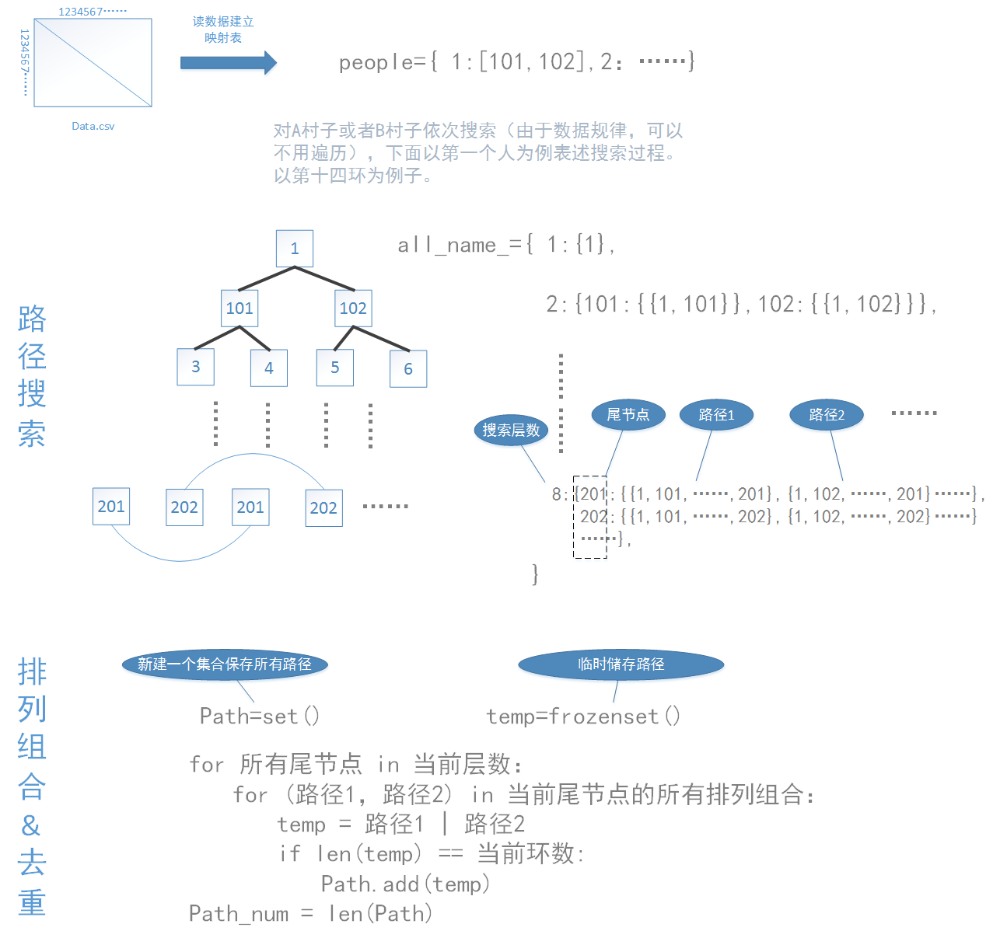

# ZET2020Fourier-Preliminary
2020zet初赛思路

## 赛题回顾

   ### 丰收祭前的游戏
    在某片遥远的大陆上，居住着两个世代友好的部落，分别是部落A和部落B。他们一起耕耘劳作，互相帮助，亲如一家。久而久之，
    部落里的每个人都在对方部落里找到了志趣相投，互相欣赏的好朋友。有的人性格热情开朗，好朋友很多；有的人性格沉稳内敛，
    好朋友相对少一些。
    每到秋天丰收的季节，这两个部落的人民都会聚集在一起举行盛大的“丰收祭”，来祈祷下一年的风调雨顺。今年的丰收祭马上又
    要举行了。为了进一步增进两个部落的友谊，也为了明年能有一个好收成，这两个部落的祭司们商量后决定：在今年的丰收祭前
    举办一场特别的“击鼓传花”游戏。只不过游戏中并非有人真的击鼓，并且所传递的“花”也不是真的花，而是等待在丰收祭上献上
    的祭品。
游戏规则如下：

1. 两个部落的所有人都可以事先准备自己的祭品，且每个人的祭品样式都不同，每一个祭品都分别盛放在一个相对应的木托盘里；准备此祭品的人熟悉自己的祭品；
2. 每个人可以准备的祭品数量不限；祭品的最小不可分割单位是1份；
3. 游戏开始后，在整个游戏过程中，每个人都能且只能将祭品（包括木托盘）传递给自己在对方部落里的好朋友们，每个好友可以接收的祭品数量不限；
4. 收到祭品的人必须在盛放此祭品的木托盘上刻上自己的名字（代表留下自己美好的祝愿），随后按照上一条规则，继续传递；
5. 如果祭品回到最初准备此祭品的人手中，此人也在木托盘上刻上自己的名字之后，终止传递；
6. 木托盘上不允许出现重复的人名，如果无法满足此条件，则不再继续传递该祭品；
7. 当所有的祭品都不再传递后，游戏结束；

游戏开展得非常顺利。游戏结束后，祭司们将收集同时满足如下三个条件的祭品用于接下来的丰收祭活动：
    
1. 此祭品回到了最初准备它的人手中；
2. 盛放此祭品的木托盘上至少有4个名字，至多有14个名字；
3. 如果有多个木托盘上的名字完全一样（不区分名字的排列顺序），则从其中随机选择一个木托盘所对应的祭品。

问题：

已知这两个部落里的所有人都不重名，并且部落A的人和部落B的人之间的好朋友关系以附件的csv数据表格文件给出，其中行索引代表部落A中的人，列索引代表部落B中的人，表格中的数字“1”代表他们两人是好朋友，“0”代表他们两人不是好朋友。请问：
如果以木托盘上的名字的数量对用于丰收祭的祭品分类，每一类分别最多有多少个祭品？

请参赛者答题：

木托盘上有4个名字的祭品最多有（）个；木托盘上有6个名字的祭品最多有（）个；木托盘上有8个名字的祭品最多有（）个；木托盘上有10个名字的祭品最多有（）个；木托盘上有12个名字的祭品最多有（）个；木托盘上有14个名字的祭品最多有（）个；
请在每个（）中填写一个正整数答案；
    
网上初赛将分为两个阶段，其中第一阶段将于赛题发布的同时启动。第二阶段于4月30日启动，参赛者需参加全部两阶段的比赛。两阶段的结果准确性得分及排名互相独立。即第二阶段启动后，第一阶段的的得分及排名将不再更新。赛事方将根据参赛者在两阶段比赛中提交的结果的准确性得分和参赛者所设计的算法的效率给出参赛者的综合成绩。

## 思路
首先看到这个题目描述是一个传递盘子的游戏，礼物没有限制，写出最多的可能的盘子数量。那么首先想到的就是穷举法，把所有可能存在的环全部列举出来。
穷举首先想到的就是深度优先搜索（DFS），针对每一个人搜索，并且搜索过程中做初步去重，就是避免一条链中的重复元素。但是稍作分析可以发现，最大环数是15，那就代表要搜索到15层，试了一下不可能在规定时间计算完成，因此做了以下几点改进：

1.搜索环数由15层降低为8层，第八层结果中任意找2个重复的元素，翻转其中一个链就可以组合成14的环，然后再检测环中是否有重复的元素，有重复
    
2.分析数据可以发现，由于好友关系只能是与对方村子的联系，所以A村子所有人的环数和B村子所有人的环数必定会出现重复，所以步骤1）只需要对A、B任意一个村子进行搜索就行。
    
3.分析数据，数据类似于循环的阵列LDPC码，其中满足一定数量的人员是没有交集的，并且计算环数时，他们的计算地位是等价的。
    
4.继续分析数据，发现数据规律是以64为循环（二阶段数据是192），即每64个人他们的计算是等价的，即开始传递人员为1-64，65-128等等的时侯，他们的结果环数必定相等，因此简化计算。
    
5.最终环数要除以环的元素个数的一半（为什么是一半呐，因为步骤2中已经减去了一半计算量了），例如累加得到14环有N个，那么最终不重复14环数目为N/7，因为环中这7个人都会重复统计一次

#### 部分思路流程图

#### 去重
	首先是在深度优先（DFS）搜索过程中对于重复元素的剪枝，接着用到了python中的集合set()，用集合来保存所有符合的环，因为set()本身就不包含重复元素，所以最后输出集合的长度就行

#### 测试
    代码64行修改文件路径，结果输出至result.txt中。

## 联系方式

* mail(ouyangfeng.ouc@qq.com)

